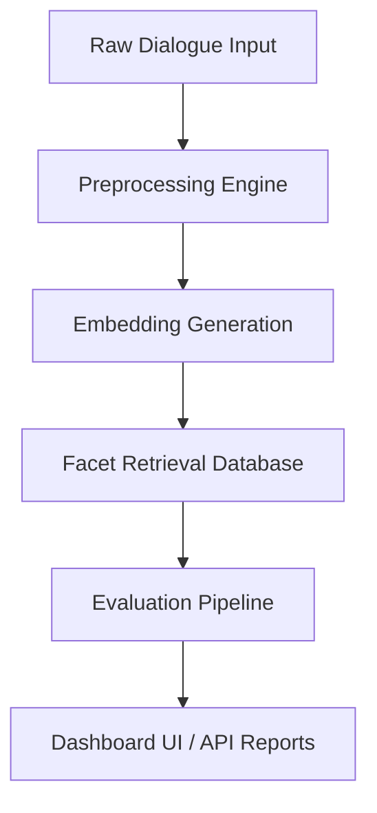

# System Architecture

High-level architecture of the Ahoum Conversation Evaluation System.

## Component Breakdowns

1. **Preprocessing**: Cleans, parses, and tokenizes multi-turn conversations.
2. **Embeddings**: Generates vector representations of conversational topics.
3. **Retrieval**: Matches incoming conversations to target evaluation facets.
4. **Evaluation**: LLM-guided scoring based on retrieved evaluation criteria.
5. **API & UI**: Services to view reports, trigger audits, and query scores.
